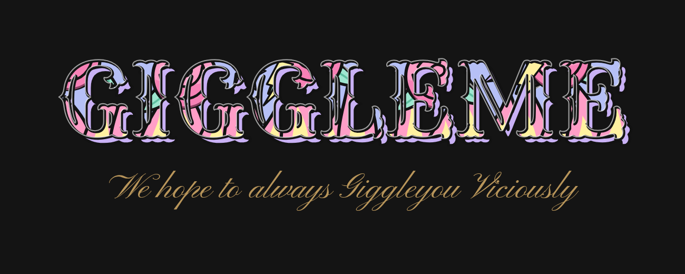
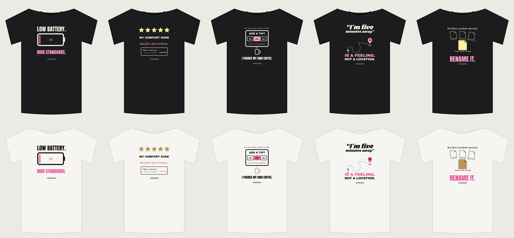

# GiggleMe designs



*We hope to always Giggleyou Viciously.*



## What's here

| Folder | What it is |
|---|---|
| `brand/giggleme-logo.png` | The official logo: retro-script GiggleMe with "viciously." centered under it (transparent PNG). Use it for the store header, banners and big prints. |
| `brand/giggleme-wordmark.png` | The letters only. Use it for small spots like shirt tags, profile pictures and packing slips. |
| `shirts/<design>/print-dark-shirts.png` | Print file for **black, navy and charcoal** shirts. Upload this to Printful. |
| `shirts/<design>/print-light-shirts.png` | Print file for **white, cream and light heather** shirts. |
| `shirts/<design>/mockup-*.png` | Quick previews. Use Printful's mockups for the store photos. |
| `shirts/<design>/design-*.svg` | Editable vector versions of each design. |
| `gamer-01/` | Five gamer tees based on the "paused my game" top seller, with print files and mockups. See its README. |
| `social/LAUNCH-KIT.md` | Profile pictures, banners, bios and the first week of posts for TikTok, Instagram and YouTube. Images are in `brand/social/`. |
| `source/` | The code that draws everything. Shirts: change `designs.mjs`, then `npm install` and `npm run build`. Logo: `node logo-final.mjs`. |

Every print file is **3600 × 4800 px at 300 DPI** (12 × 16 in, the standard Printful tee front area), with a transparent background. All fonts are open-license (SIL OFL), so they're safe to use on products you sell.

## The logo

**GiggleMe** in an old-school retro script (Yellowtail), with the first **G** and the **M** at double height. The letters are a dark matte grey (`#4A4E55`) with a hard black outline, a matte-gold outer outline (`#B8955A`) and a black drop shadow. The full logo adds **viciously.** centered underneath: lowercase, small, plain Inter in matte gold.

- Keep the logo as is: don't recolor, stretch or add effects.
- Use the letters-only wordmark anywhere smaller than about 3 inches wide, and on shirt chests.
- It reads best on black, charcoal and navy. On white, the black and gold outline carries it.

## Brand colors

| Name | Hex | Use |
|---|---|---|
| Cotton Candy Pink | `#FF9EC7` | Roses, flames, punchlines |
| Baby Blue | `#9FD3F7` | Main fill inside the letters, accents |
| Lavender | `#C9B1F5` | Logo shadow, stars |
| Mint | `#9EE6CF` | Leaves, small accents |
| Lemon | `#FFF1A0` | Lightning, flame centers, highlights |
| Matte Gold | `#B8955A` | Tagline; accents on white shirts |
| Tattoo Black | `#121212` | Outlines, text on light shirts |
| Bone | `#F7F1E3` | Text on dark shirts |

On white shirts, use the deeper versions so they stay readable: pink `#E8559A`, blue `#3E8FD0`, lavender `#8F6BD8`.

Fonts: **Yellowtail** (logo), **Rye** (Series 01 back letters), **Inter** ("viciously." under the logo), **Anton** and **Archivo Black** (shirt headlines), **DM Serif Display** and **Shrikhand** (sayings), **Space Mono** (small details).

## Put a design in your store

1. In Printful, open **Stores → GiggleMe → Add product** and pick a soft tee (e.g. Bella+Canvas 3001).
2. Choose your shirt colors. **Start with Black, Navy and Dark Grey Heather** and upload `print-dark-shirts.png`. Bold colors on dark shirts look best on camera.
3. Keep the design at the top of the print area, centered. Don't stretch it.
4. Optional: add white and cream colors with `print-light-shirts.png`. If Printful won't take a different file for some colors on that product, make a separate "light" listing later.
5. Generate mockups, then paste the title, description and tags below. Price it at $27.99.
6. Submit to store. Repeat for each design. Save the first one as a **product template** to make the rest faster.

## Listing text

**1. Low Battery. High Standards. Tee**
*Theme: Straight to the Punchline · Tags: `tee, theme-punchline`*
> For people running on 2% who still won't settle. Printed just for you.

**2. My Comfort Zone Has Five-Star Reviews Tee**
*Theme: Straight to the Punchline · Tags: `tee, theme-punchline`*
> Verified homebody. Never leaving. Five stars, would stay in again.

**3. The Tip Screen Asked for 25% Tee**
*Theme: Brutally Current · Tags: `tee, theme-current`*
> You scanned it. You bagged it. You poured it. Wear the receipt.

**4. "I'm Five Minutes Away" Is a Feeling Tee**
*Theme: Funny Because It's True · Tags: `tee, theme-truth`*
> For the friend who's "almost there" and still in the shower. You know who you are.

**5. If at First You Don't Succeed, Rename It Tee**
*Theme: Sayings, Upgraded · Tags: `tee, theme-sayings`*
> final.png, final2.png, FINAL_final.png… we've all been there. Wisdom, upgraded.

Add these bullets under each description:

```
• Super soft, lightweight cotton
• Printed just for you when you order
• Fits true to size; see the Size Guide
• Ships in about [X–Y] business days
```

## Before you print

- Order one sample of your favorite to check colors and size in person.
- Search each phrase at tmsearch.uspto.gov (clothing, Class 25). These were written fresh for GiggleMe, but short phrases can already be someone's trademark.
- Each design has a small GiggleMe wordmark tag under it. To remove it, delete the `${tag(...)}` line for that design in `source/designs.mjs` and rebuild.
