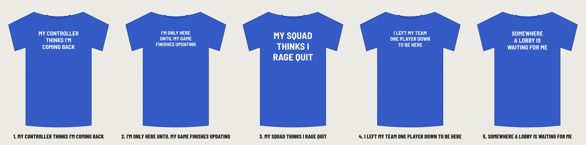

# Classic 01: the top seller's look, with GiggleMe phrases

Same style as the proven "paused my game" tee: big white bold condensed capitals, three centered lines, royal blue heather shirt, no graphics. The difference is our own phrase. The front has no logo: GiggleMe goes on the inside back neck label. None reuse the original's phrase, which has had trademark filings.

| # | Phrase | Why it should sell |
|---|---|---|
| 1 | **MY CONTROLLER / THINKS I'M / COMING BACK** (recommended) | Same "I'd rather be gaming" joke, told from the controller's side. Short, clean, gift-friendly. |
| 2 | I'M ONLY HERE / UNTIL MY GAME / FINISHES UPDATING | Every gamer has waited on a giant update. |
| 3 | MY SQUAD / THINKS I / RAGE QUIT | Big, short words that read from across a room. |
| 4 | I LEFT MY TEAM / ONE PLAYER DOWN / TO BE HERE | Closest in rhythm to the original, with new stakes. |
| 5 | SOMEWHERE / A LOBBY IS / WAITING FOR ME | A little dramatic. Funny at weddings and family events. |

## Upload to Printful

Everything to upload is in **`printful-upload/`**, one file per design and shirt color:
- `classic-01-<design>-FRONT-dark-shirts.png`: white text for **royal blue heather, black, navy, charcoal**.
- `classic-01-<design>-FRONT-light-shirts.png`: black text for **white, sand, light heather**.
- `giggleme-inside-label-dark-shirts.png` / `-light-shirts.png`: the GiggleMe logo for the inside back neck label (900 × 339 px, Printful's 3 × 1.13 in logo area at 300 DPI). Printful adds the size, origin and fabric text itself.

Front files are transparent, 300 DPI and trimmed to the art (about 11 in wide). Center them at the top of the front print area.

Each design folder also has editable `design-*.svg` files, full-canvas `print-*.png` files (3600 × 4800) and `mockup-royal/black/white.png` previews.

Font: Barlow Semi Condensed Bold (SIL OFL, safe for products you sell). To change a phrase, edit `source/classic.mjs`, run `node classic.mjs`, then `node printful-pack.mjs classic-01`.
