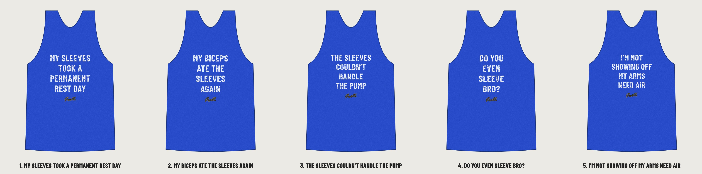

# Classic 02: the flex tank look, with GiggleMe phrases

Same style as the proven flex tank top seller: distressed white bold condensed capitals, four centered lines, royal blue tank, no graphics. The difference is our own gym joke and the GiggleMe wordmark under it. None reuse the original's phrase.

| # | Phrase | Why it should sell |
|---|---|---|
| 1 | **MY SLEEVES / TOOK A / PERMANENT / REST DAY** (recommended) | Explains the tank with a joke every lifter gets. Same "where did the sleeves go" laugh, told our way. |
| 2 | MY BICEPS / ATE THE / SLEEVES / AGAIN | Short words, reads from across the gym. The "again" makes it a brag. |
| 3 | THE SLEEVES / COULDN'T / HANDLE / THE PUMP | Real gym slang, so it lands with regulars. |
| 4 | DO YOU / EVEN / SLEEVE / BRO? | Twists the "do you even lift" meme everyone already knows. |
| 5 | I'M NOT / SHOWING OFF / MY ARMS / NEED AIR | A fake excuse for showing off. Gym, beach and cookouts. |

Each folder has:
- `print-dark-shirts.png`: distressed white text for **royal blue, black, navy, charcoal**. 3600 × 4800 px, 300 DPI, transparent. Upload this to Printful.
- `print-light-shirts.png`: distressed black text for **white, sand, light heather**.
- `design-*.svg`: editable vector versions (the worn texture is an SVG filter).
- `mockup-royal.png`, `mockup-black.png`, `mockup-white.png`: tank top previews.

Font: Barlow Condensed Bold (SIL OFL, safe for products you sell). The worn texture is generated, so the holes are real transparency in the print file. To change a phrase, edit `source/classic-02.mjs` and run `node classic-02.mjs`.
