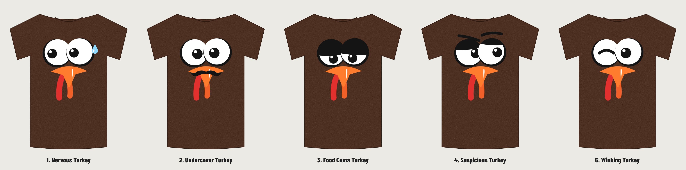

# Classic 03: the turkey face tee, with a GiggleMe twist

Same look as the proven turkey face top seller: brown tee, one big flat cartoon face filling the chest, white googly eyes with a dark rim, orange beak with a white shine, red and orange snood, no text. The twist is the face itself: each version changes the eyes and adds at most one small detail. The front has no logo: GiggleMe goes on the inside back neck label.

| # | Design | What changes | Why it should sell |
|---|---|---|---|
| 1 | **Nervous Turkey** (recommended) | Pupils dart sideways, one bead of sweat | The turkey knows what's for dinner. Same face, instant story, still no words needed. |
| 2 | Undercover Turkey | Stick-on mustache over the beak | A disguise so nobody recognizes him on Thanksgiving. One added shape, big laugh. |
| 3 | Food Coma Turkey | Heavy eyelids, pupils sinking | How everyone looks after the second plate, so the whole table gets it. |
| 4 | Suspicious Turkey | Side-eye under one raised brow | Reads as "I saw you sharpen that knife." |
| 5 | Winking Turkey | One cheeky wink | The friendliest version, good for kids, families and matching group shirts. |

## Upload to Printful

Everything to upload is in **`printful-upload/`**, one file per design and shirt color:
- `classic-03-<design>-FRONT-dark-shirts.png`: for **brown** (like the original), black, navy, charcoal.
- `classic-03-<design>-FRONT-light-shirts.png`: same face with a thin dark outline, for **white, sand, light heather**.
- `giggleme-inside-label-dark-shirts.png` / `-light-shirts.png`: the same GiggleMe inside neck label files as Classic 01 and 02.

Front files are transparent, 300 DPI and trimmed to the art (about 10.8 in wide). Center them at the top of the front.

Each design folder also has editable `design-*.svg` files, full-canvas `print-*.png` files (3600 × 4800) and `mockup-brown/black/white.png` previews.

No fonts on the shirt; all shapes are drawn from scratch. To tweak a face, edit `source/classic-03.mjs`, run `node classic-03.mjs`, then `node printful-pack.mjs classic-03` (and copy the label files from `brand/` back in).
