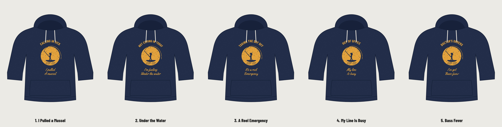

# Classic 04: the fishing-excuse hoodie, with GiggleMe puns

Same look as the proven seller: navy pullover hoodie, worn gold print, arched caps on top, a big sun circle with an angler casting from a small boat, and a script punchline underneath. Only the joke changes: five original fishing puns (the original's phrase is not used). No logo on the front; GiggleMe goes on the inside back neck label.

| # | Top line | Punchline | Why it should sell |
|---|---|---|---|
| 1 | CALLING IN SICK | I pulled a mussel | Same fake-injury excuse, our own pun. Everyone hears "muscle" first. |
| 2 | NOT COMING IN TODAY | I'm feeling under the water | Twists "under the weather". Sick note and fishing trip in one. |
| 3 | TAKING THE DAY OFF | **It's a reel emergency** (recommended) | The reel/real pun lands with non-anglers too, so it sells to gift buyers. |
| 4 | OUT OF OFFICE | My line is busy | Office language doing double duty for weekend anglers. |
| 5 | DOCTOR'S ORDERS | I've got bass fever | Names the fish, so bass anglers claim it. |

## Upload to Printful
Everything is in `printful-upload/`: `classic-04-<design>-FRONT-dark-shirts.png` (gold ink, for navy, black, charcoal) and `-light-shirts.png` (navy ink, for white, sand, heather), plus the two GiggleMe inside-label files. Fronts are transparent, 300 DPI, trimmed to the art.

Each design folder also has editable SVGs, full-canvas `print-*.png` (3600 x 4800) and `mockup-navy/black/white.png`. Rebuild: `cd source && node classic-04.mjs && node printful-pack.mjs classic-04` (then copy labels from `brand/`).
