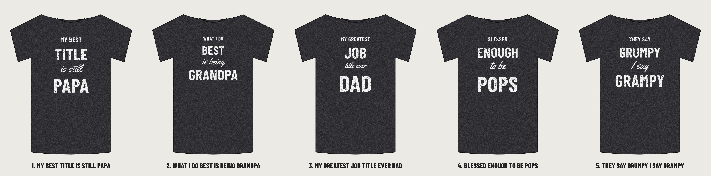

# Classic 05: the "favorite people" family tee, with GiggleMe lines

**Final set for Top 20 slot 5 (Dazzle, 2026-10-06): all five designs below.** Recommended pick: 1, My best title is still Papa.

Same look as the proven seller: heather black tee, distressed white print, a centered stack of small caps, big condensed caps, a script line and a huge condensed caps family name. Only the wording changes: five original GiggleMe lines (the original's phrase is not used). No logo on the front; GiggleMe goes on the inside back neck label.

| # | Small caps | Big caps | Script | Huge caps | Why it should sell |
|---|---|---|---|---|---|
| 1 | MY BEST | TITLE | is still | **PAPA** (recommended) | Same warm brag about the name the family gives him, said our way. Easy Father's Day and birthday gift. |
| 2 | WHAT I DO | BEST | is being | GRANDPA | Opens the grandpa market, the biggest gift-buyer group for this style. |
| 3 | MY GREATEST | JOB | title ever | DAD | Work joke plus dad pride. Sells to new dads and to kids buying for Dad. |
| 4 | BLESSED | ENOUGH | to be | POPS | Heartfelt and short. Pops is a name many grandpas actually go by. |
| 5 | THEY SAY | GRUMPY | I say | GRAMPY | The funny one. The rhyme lands in one read and suits the grumpy-grandpa gift crowd. |

## Upload to Printful
Everything is in `printful-upload/`: `classic-05-<design>-FRONT-dark-shirts.png` (white ink, for heather black, black, navy, charcoal) and `-light-shirts.png` (black ink, for white, sand, light heather), plus the two GiggleMe inside-label files. Fronts are transparent, 300 DPI, trimmed to the art.

Each design folder also has editable SVGs, full-canvas `print-*.png` (3600 x 4800) and `mockup-heather-black/navy/white.png`. Rebuild: `cd source && node classic-05.mjs && node printful-pack.mjs classic-05` (then copy labels from `brand/`).
