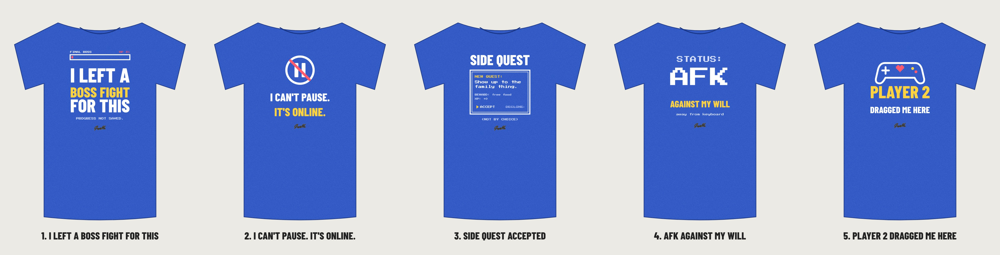

# Gamer 01: based on the "paused my game" top seller

**Why the reference tee sells:** one relatable gamer joke, a built-in gift moment (weddings, family dinners, holidays), and big white condensed text on royal blue heather that reads from across a room. Its weak spot is that it's plain text, so every copy on Amazon and Walmart looks the same. Its exact phrase has also had trademark filings, so we don't use it.

**Our upgrade:** keep the same buyer, joke and colorway, and add one visual gag (health bar, pause icon, quest box, pixel type, controller) so ours stands out in a thumbnail.

| # | Design | Why it should sell |
|---|---|---|
| 1 | **I Left a Boss Fight for This** (recommended) | Same joke as the original with higher stakes: the boss is at 3% HP. "Progress not saved." lands the punchline. |
| 2 | I Can't Pause. It's Online. | The line every gamer has yelled at a parent. Huge icon, very readable. |
| 3 | Side Quest Accepted | Retro RPG quest box for family events. Most detailed, so best on adults who like retro games. |
| 4 | AFK Against My Will | Minimalist pixel type. Simplest to print and easy to read small. |
| 5 | Player 2 Dragged Me Here | Couples and date-night gift. Sets up a matching "Player 1" tee later. |

Each folder has:
- `print-dark-shirts.png`: white and gold ink for **royal blue heather, black, navy, charcoal**. 3600 × 4800 px, 300 DPI, transparent. Upload this to Printful.
- `print-light-shirts.png`: dark ink for **white, sand, light heather**.
- `design-*.svg`: editable vector versions.
- `mockup-royal.png`, `mockup-black.png`, `mockup-white.png`: quick previews.

Fonts are Barlow Condensed and Press Start 2P (both SIL OFL, safe for products you sell). To change a design, edit `source/gamer.mjs` and run `node gamer.mjs`.
