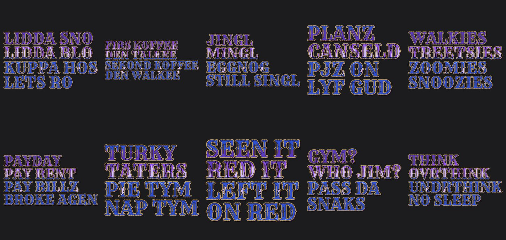
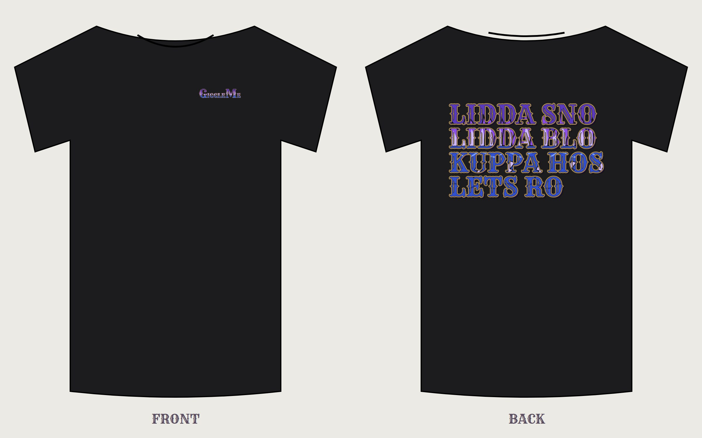

# GiggleMe Series 01

Ten tees: the **GiggleMe logo** (with a double-height G and M) on the front left chest, and a stacked saying across the back at Printful's biggest back size. Front and back letters match: tattoo-style art inside each letter in **royal blue and royal purple** (blue waves, purple flames, lilac lightning; no roses or stars), a deep purple shadow, and a bold **matte-gold outline**. Every letter on a back is the same size, every line starts at the same left edge, and the block is centered top to bottom.

## Files

| File | Where it prints | Size |
|---|---|---|
| `logo-left-chest.png` | **Front, left chest** (same file on every shirt): GiggleMe with the first G and the M at double height, in the same royal/gold style as the backs | 1200 × 267 px · 4 in wide · 300 DPI |
| `<design>/back-print.png` | **Back**, oversize | 4500 × 5400 px · 15 × 18 in · 300 DPI |
| `<design>/mockup.png` | Preview only | |

This royal-and-gold look is made for **black and charcoal** shirts (navy works but the royal blue blends in more). On white or cream the gold outline reads softer.

## Set it up in Printful

1. **Add product** → pick a tee that offers the **oversize 15 × 18 in back print** (filter for it in Printful's product list). If you choose a tee without it, Printful shrinks the back to 12 × 16 in.
2. Under **Front**, choose the **Left chest** placement and upload `logo-left-chest.png`. Keep it about 3.5–4 in wide.
3. Under **Back**, choose the oversize/large back placement and upload that design's `back-print.png`. Keep it centered and full size (about 15 in wide).
4. Pick colors: start with **Black** and **Navy**.
5. Price: two print spots plus an oversize back cost more at Printful, so price around **$34.99–36.99**.
6. Paste the listing text below and submit. Save the first one as a product template.

## Listing text

| # | Title | Description | Theme tag |
|---|---|---|---|
| 01 | Lidda Sno Tee | Lidda sno. Lidda blo. Kuppa hos. Lets ro. | theme-sayings |
| 02 | Firs Koffee Tee | The morning routine, spelled the way it feels before coffee. | theme-truth |
| 03 | Jingl Mingl Tee | Jingl. Mingl. Eggnog. Still singl. The holiday party, summed up. | theme-current |
| 04 | Planz Canseld Tee | The best text you'll get all week. PJs on, life good. | theme-truth |
| 05 | Walkies Zoomies Tee | A dog's whole schedule. Walkies, treetsies, zoomies, snoozies. | theme-punchline |
| 06 | Payday Broke Agen Tee | Payday lasts about four minutes. This shirt lasts longer. | theme-current |
| 07 | Turky Taters Tee | Turky, taters, pie tym, nap tym. Your Thanksgiving game plan. | theme-sayings |
| 08 | Seen It On Red Tee | Seen it. Red it. Left it on red. No further questions. | theme-truth |
| 09 | Who Jim Tee | Gym? Who Jim? Pass da snaks. | theme-punchline |
| 10 | Ovrthink Tee | Think, ovrthink, undrthink, no sleep. Built for 3 a.m. brains. | theme-truth |

Add the usual bullets under each description (soft cotton, printed just for you, fits true to size, ships in X–Y business days).

## Rebuild

`cd ../source && npm install && node series.mjs`. Edit the `SAYINGS` list in `series.mjs` to add or change shirts.
