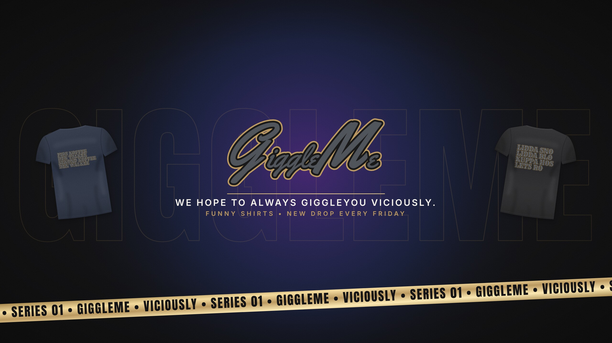

# GiggleMe social launch kit

Everything to set up TikTok, Instagram and YouTube in one sitting, then a plan for the first seven days of posting. The detailed TikTok playbook (pinned videos, growth rules, two-week plan) is in `designs/tools/tiktok-plan.html`; this page covers all three apps.

Use the same handle everywhere: **@giggleme** (if it's taken, the backups in the TikTok plan, in that order). Sign up for all three with the brand email, not a personal one.



## Files to upload

All in `designs/brand/social/`.

| App | Spot | File | Size |
|---|---|---|---|
| TikTok | Profile photo | `channel-icon-tiktok-1080.jpg` | 1080 × 1080 |
| Instagram | Profile photo | `channel-icon-tiktok-1080.jpg` (same file) | 1080 × 1080 |
| Instagram | Story highlight covers | `ig-highlight-shop.jpg`, `-drops`, `-lidda`, `-laughs`, `-faq` | 1080 × 1920 |
| YouTube | Profile picture | `channel-icon-youtube-800.jpg` | 800 × 800 |
| YouTube | Banner | `youtube-banner.jpg` | 2560 × 1440 |
| YouTube | Video watermark | `youtube-watermark-150.png` | 150 × 150 |

The profile picture is the GM channel image on every app, so the brand looks the same wherever someone taps. `channel-icon-circle-preview.png` shows how it looks once the apps crop it to a circle.

The YouTube banner keeps the logo and tagline inside the area phones show; desktops add the two shirts, and TVs add the gold tape. `youtube-banner-safe-areas.png` shows those areas marked (don't upload that one).

To change any of these, edit `source/social-kit.mjs` (banner, highlights, watermark) or `source/channel-icon.mjs` (profile picture) and run it with `node`.

## TikTok

Set up exactly as the TikTok plan says (Business account, Clothing & Accessories).

| Field | Paste this |
|---|---|
| Name | `GiggleMe` |
| Username | `giggleme` |
| Bio (before launch) | We hope to always Giggleyou Viciously.<br>First drop soon. Get on the list 👇 |
| Bio (after launch) | We hope to always Giggleyou Viciously.<br>Funny shirts. New drop every Friday 👇 |
| Website | Store password page before launch, store home page after |

Both bios fit TikTok's 80-character limit (73 and 76).

## Instagram

Switch to a **Professional account → Business → Clothing (Brand)** so you get insights and a shop tab later.

| Field | Paste this |
|---|---|
| Name | `GiggleMe \| Funny Shirts` |
| Username | `giggleme` |
| Bio (before launch) | We hope to always Giggleyou Viciously.<br>Funny shirts that say it for you 👕<br>Series 01 drops soon<br>👇 Get on the list first |
| Bio (after launch) | We hope to always Giggleyou Viciously.<br>Funny shirts that say it for you 👕<br>New drop every Friday<br>👇 Shop the drop |
| Link | Same link as TikTok |
| Category | Clothing (Brand), shown on profile |

The Name field is searchable, so "Funny Shirts" in it helps people find you. Both bios are under Instagram's 150-character limit (118 and 111).

**Story highlights**, left to right: **SHOP** (product photos and the link sticker), **DROPS** (countdowns and reveals), **LIDDA** (the Lidda Sno / Lidda Sun saga), **LAUGHS** (reposted reactions and customer photos), **FAQ** (sizing, shipping, returns). Post one story to each, then add it as a highlight and pick the matching cover.

**Pin your first three posts** to the top of the grid: the same three videos as the TikTok pins.

## YouTube

Studio → **Customization**:

| Field | Paste this |
|---|---|
| Name | `GiggleMe` |
| Handle | `@giggleme` |
| Banner | `youtube-banner.jpg` |
| Picture | `channel-icon-youtube-800.jpg` |
| Video watermark | `youtube-watermark-150.png`, display: entire video |
| Links | Store (title "Shop GiggleMe"), TikTok, Instagram |
| Contact email | The brand email |

**Description** (paste as is):

```
We hope to always Giggleyou Viciously.

GiggleMe makes funny shirts that say it for you. Series 01 is the Lidda saga: Lidda Sno, Firs Koffee, Lidda Sun and more, printed on soft black and navy tees.

New Shorts every day: strangers reading our shirts out loud, friends trying not to laugh, and the sayings you comment that we turn into real shirts.

New drop every Friday. Shop the drop at the link above.
```

## First week of posting

One video a day, filmed once and posted to all three: **TikTok**, **Instagram Reels** and **YouTube Shorts**. Post in the evening (around 6–9 pm your time) to start, then move to whatever hour your TikTok analytics show your followers are most active after week one.

Film days 1–4 in one session in the sample shirts (launch checklist step F) so you're never stuck for a post.

| Day | Video (all three apps) | Instagram story | Goal |
|---|---|---|---|
| 1 | The three pinned videos: **"We made shirts that say it for you"**, **"Lidda Sno or Lidda Sun?"**, **"Read it out loud. I dare you."** Pin all three on TikTok and Instagram. | One story per highlight so all five covers go up | Profile looks alive on day one |
| 2 | **"Read it out loud"** with Lidda Sno: a friend reads the back, keep the laugh | Poll: "Lidda Sno or Lidda Sun?" | Find which shirt gets the biggest laugh |
| 3 | **"Strangers read my shirt out loud"** in Firs Koffee | Behind the scenes of filming | Same, second shirt |
| 4 | **"Read it out loud"** with Lidda Sun | Reshare the best comment from days 2–3 | Same, third shirt |
| 5 | **"Comment a saying. We print the best one."** | Question sticker: "Give us a shirt saying" | Comments, followers, new shirt ideas |
| 6 | Read the best comments so far out loud, in the shirt | Repost day 5 to stories with the link sticker | Keep the comments coming |
| 7 | Remake whichever of days 2–4 got the most views, with a different shirt | Countdown sticker for the first drop | Repeat the winner |

Every day:
- Reply to every comment in the first hour after posting.
- Write the hook as on-screen text in the first second, and say the shirt's words out loud.
- Captions: one short line plus `#funnyshirts #giggleme` and one or two that fit the video (`#coffee`, `#winter`, `#summer`). Keep it under five hashtags.
- No trending songs on the Business accounts; your own voice works best for these anyway.

At the end of the week, write down views for each video on each app. Days 8–14 in the TikTok plan pick up from there: remake the winner and start the drop countdown.
